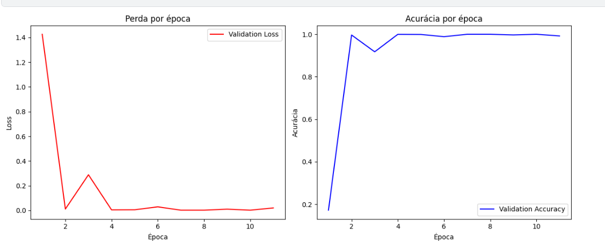
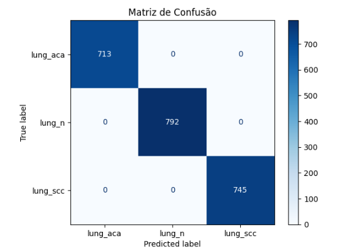
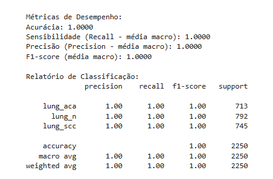
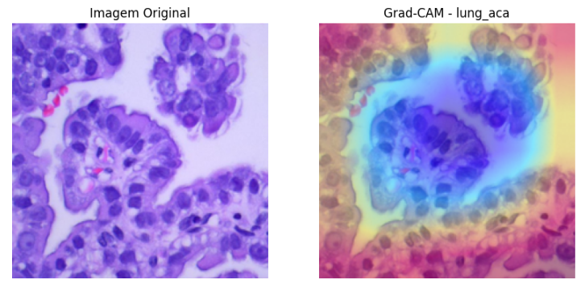
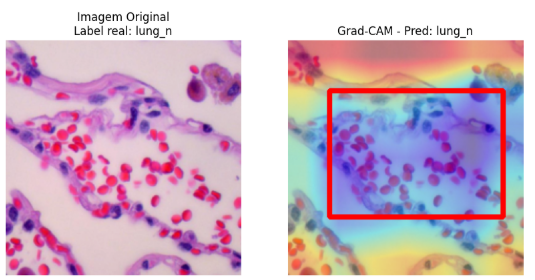
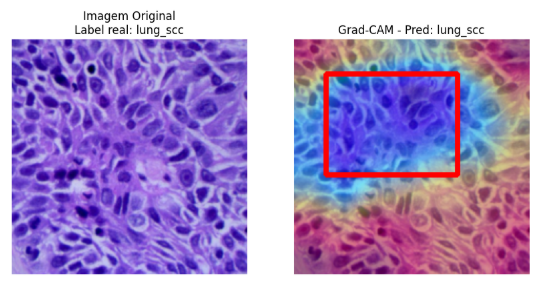
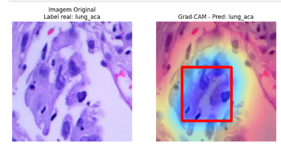

# Classificação de Câncer de Pulmão com a Arquitetura VGG

Este repositório contém a implementação e os resultados do treinamento de uma Rede Neural Convolucional (CNN) baseada na arquitetura **VGG19** para a classificação automatizada de imagens histopatológicas de tecido pulmonar em três classes: **adenocarcinoma**, **carcinoma de células escamosas** e **tecido saudável**.

O projeto faz parte de um estudo comparativo mais amplo, e esta documentação é focada especificamente nos processos, resultados e conclusões obtidos com o modelo VGG.

## 1. Metodologia e Processos

### 1.1. Arquitetura do Modelo
Foi utilizada a arquitetura **VGG19**, uma rede neural profunda conhecida por sua simplicidade e uso de filtros convolucionais de `3x3`. A técnica de **Transferência de Aprendizado (Transfer Learning)** foi aplicada, utilizando pesos pré-treinados no dataset ImageNet para acelerar a convergência e melhorar a performance do modelo.

### 1.2. Conjunto de Dados e Pré-processamento
* **Dataset:** O projeto utilizou o dataset público **LC25000** (disponível no Kaggle), focado em imagens histopatológicas de pulmão.
* **Pré-processamento:** As imagens foram padronizadas para o formato de entrada da VGG, com redimensionamento para `224x224` pixels. Em seguida, foi aplicada a normalização dos valores dos pixels com as médias e desvios padrão do ImageNet para otimizar o uso do Transfer Learning.

### 1.3. Ambiente e Ferramentas
* **Linguagem:** Python 3.11
* **Framework de Deep Learning:** PyTorch e Pytorch Lightning
* **Interpretabilidade:** Grad-CAM
* **Ambiente de Execução:** Google Colab e Kaggle Notebooks (com suporte de GPU)

## 2. Treinamento e Validação

### 2.1. Evolução do Treinamento
O modelo foi treinado por mais de 100 épocas. A performance foi monitorada em um conjunto de validação, e os gráficos de Acurácia e Perda por Época demonstraram uma rápida estabilização, indicando uma boa capacidade de generalização do modelo desde as iterações iniciais.



### 2.2. Resultados no Conjunto de Validação
No conjunto de validação, o modelo VGG19 alcançou um desempenho equilibrado e de alta performance:
* **Acurácia:** **99,69%**
* **Métricas Adicionais:** A média macro para `recall` e `precision` também ficou acima de 99%.

### 2.3. Resultados no Conjunto de Teste (Performance Final)
A robustez e a capacidade de generalização do modelo foram confirmadas no conjunto de teste, com dados nunca antes vistos.
* **Acurácia Final:** **99,24%**
* **Métricas Adicionais:** O F1-score, precision e recall (média macro) ficaram próximos de 1.0, confirmando a alta performance.



### 2.4. Análise de Interpretabilidade com Grad-CAM
Para garantir a transparência e a confiabilidade do modelo, a técnica **Grad-CAM** foi aplicada para gerar mapas de calor. Essas visualizações destacam as regiões da imagem que mais influenciaram a decisão da rede, permitindo uma validação visual do processo de classificação.



## 3. Conclusão

A arquitetura VGG19, quando combinada com Transfer Learning, demonstrou ser uma ferramenta poderosa e eficaz para a tarefa de classificação de imagens histopatológicas de câncer de pulmão, alcançando uma acurácia de **99,24%** em dados de teste.

O modelo não apenas atingiu um alto nível de precisão, mas a aplicação de técnicas como Grad-CAM reforçou sua interpretabilidade, um fator crucial para a confiança e a potencial aplicação em ambientes clínicos como ferramenta de apoio ao diagnóstico. O projeto valida a VGG19 como uma arquitetura robusta para tarefas complexas de visão computacional na área da saúde.




## Como Utilizar este Projeto

1.  **Clone o repositório:**
    ```bash
    git clone [(https://github.com/HitoshiSatoo/Treinamento_VGG_cancer)]
    ```
2.  **Estrutura de Dados:**
    * Baixe o dataset LC25000 do Kaggle.
    * Organize as imagens nas pastas `train`, `val` e `test`, com as subpastas para cada classe (`lung_aca`, `lung_n`, `lung_scc`).
3.  **Execute os notebooks:**
    * Siga os notebooks focados no modelo VGG para realizar o pré-processamento, treinamento e avaliação.
